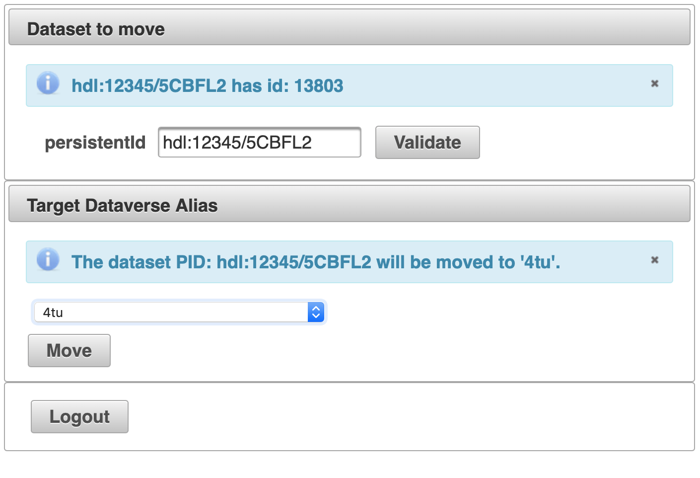

# Dataverse Datasetmover Tool 
Move a dataset to another dataverse. (Note that this is obsolete since dataverse v4.14)

Sometimes you need to move a dataset from the verse it is in to another verse. 
For instance if a given verse is split into subverses and you want to divde the datasets among those subverses. 
Also you might want to move because of changes in policy that are better supported in the other verse. 
Note that the dataset data, metadata, PID and landing page are not changed in any way by moving. 

The tool works with Dataverse 4.8.6 and later because it needs the "datasets/{id}/move/{newDataverseAlias}" API.

How to install:
1. Download the latest release from [https://github.com/DANS-KNAW/dataverse-datasetmover](https://github.com/DANS-KNAW/dataverse-datasetmover).
2. Either use the released war file, or download the sources and build with `mvn clean install`.
3. Deploy the `dmt.war` file to Glassfish where Dataverse is also deployed.
4. Open `http://<domain>/dmt/faces/index.xhtml`

Instructions for usage:
1. Browse to `dmt/faces/index.xhtml` on the same host as you have the Dataverse application instance running.
2. Login as dataverse admin user (only works with admin rights)
3. Fill out the persistent ID of the dataset you want to move. 
   The persistent ID is the id that starts with 'hdl:' or 'doi:' and can be found in the metadata or in the dataset url.
4. Click 'Validate'. If the handle is correct it will show the dataset id (dataverse specific number).
5. Select the target (sub)dataverse where the dataset should be moved to. 
   Use the dataverse alias, which is visible in the dataverse page URL and also shown as 'identifier' under the General information'. 
   Note that the dataverse should be published.
6. Click the 'Move' button.
7. A dialog pups up, click 'Yes' if sure about this move.
8. A message should show up indicating the move succeeded.

Screenshot showing the dialog with the validated PID and the selected (target) verse to move the dataset to. 
The next step would be to push the 'Move' button. 

